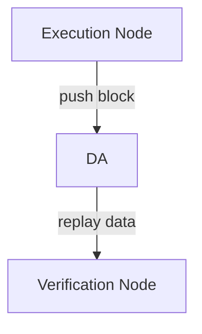

# Solana Layer2 node

A Solana based Layer 2 node. 

## Building

For how to build and test code, see [solana](https://github.com/solana-labs/solana/blob/master/README.md)'s succinct instructions.

### Design

The architecture of design as below:


There are two roles in our Layer 2: __Execution Layer__ and __Settlement Layer__.

* Execution Layer contains:
  
  * Execution Node
    
    Handles all Layer 2 transactions, produce block, push block to DA. 
  
  * Verification Node:
    
    Pull data from DA, reconstruct block and replay.

* Settlement Layer contains:
  
  * Full node:
    
    Check the challenge and push transaction data to DA.
  
  * Light node:
    
    Sync header data.

## Progress

### 1. Execution Layer



   For now, since Celestia is still unstable, we use PostgreSQL as a DA simulator, here is the execution flow:

#### Execution flow of Execution Layer

* The execution node produce blocks, we use [accountsdb-plugin-postgres](./solana-accountsdb-plugin-postgres) to save blocks into PostgreSQL database.
  
  Instructions:
  
  * Build code with submdoule
    
    ```
    git clone https://github.com/Eclipse-Laboratories-Inc/settlement.git
    cd settlement
    cargo build --release
    ```
  
  * Setup database
    
    For detailed documents of how to setup database, see [here](./solana-accountsdb-plugin-postgres#database-setup) .
    
    Suppose we got a database named `solana`, a username `solana` with password `1234`. 
    
    Then we should create Schema Objects in our solana  database.Our current directory is still `solana-executor`, so here is the command:
    
    ```shell
    psql -U solana -p 5432 -h localhost -d solana -f solana-accountsdb-plugin-postgres/scripts/create_schema.sql
    ```
    
    Let's explain the parameters in above command:
    
    * -U -- username
    
    * -p -- port of PostgreSQL server
    
    * -h -- ip address pf PostgreSQL server
    
    * -d -- database name
    
    * -f -- the path of SQL script file we want to execute
  
  * Configure plugin settings
    
    The plugin configure file is `solana-accountsdb-plugin-postgres/scripts/geyser.json`, we need change some settings in it:
    
    ```json
    {
        "libpath": "../../target/release/libsolana_geyser_plugin_postgres.dylib",
        "host": "localhost",
        "user": "solana",
        "password":"1234",
        "dbname":"solana",
        "port": 5432,
        "threads": 20,
        "batch_size": 20,
        "panic_on_db_errors": true,
        "accounts_selector" : {
            "accounts" : ["*"]
        }
    }
    ```
    
    The configuration details are:
    ```
    libpath -- Our `libsolana_geyser_plugin_postgres` lib, should be in `target/release/libsolana_geyser_plugin_postgres.dylib
    host -- PostgreSQL server ip address
    user -- Username of database
    password -- Paddword of database
    dbname -- Database name
    port -- Port of PostgreSQL server, in our case, 5432.
    ```
  
  * Start execution node
    
    For now, we use Test Validator as our execution node, we start it with plugin configure file we just set.
    
    ```shell
    ./target/release/solana-test-validator --geyser-plugin-config ./solana-accountsdb-plugin-postgres/scripts/geyser.json
    ```
    
    Now our test validator start producing blocks, and all these data saved in PostgreSQL.

* Start verification node with `--no-voting` flag, then verification node querys shred from database, replay and verify.
  ```shell=
  # replay shred and verify the blockstore
  shred-replay-service -c <pgconfig_path.json> -l <ledger_path> verify
  
  # replay shred and generate bank hash.
  shred-replay-service -c <pgconfig_path.json> -l <ledger_path> bank_hash
  ```
  
  _pgconfig_path.json_ file has same parameters as geyser plugin configuration, which means same PG settings and database name as execution node's.

#### Core designs of Execution Layer

  For Execution Node: 
  * Adding a `entry_notifier` related functions in `geyser-plugin`, which is used for writing entries into PG when validator actives.

  For Verification Node: 
  * `shred-replay-service` querys entries from PG, converts them to shreds, inserts into `blockstore`.
  *  Use `solana-ledger-tool`'s verify function, generating bank hash for whole blockstore.
  
### 2. Settlement Layer

    TBD
