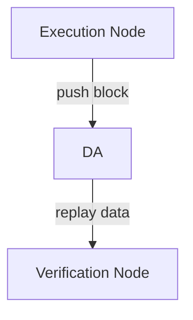

# Solana Layer2 node

A Solana based Layer 2 node. 

## Building

For how to build and test code, see [solana]([solana/README.md at master · solana-labs/solana · GitHub](https://github.com/solana-labs/solana/blob/master/README.md))'s succinct instructions.

### Design

The architecture of design as below:


There are two roles in our Layer 2: __Execution Layer__ and __Settlement Layer__.

* Execution Layer contains:
  
  * Execution Node
    
    Handles all Layer 2 transactions, produce block, push block to DA. 
  
  * Verification Node:
    
    Pull data from DA, reconstruct block and replay.

* Settlement Layer contains:
  
  * Full node:
    
    Check the challenge and push transaction data to DA.
  
  * Light node:
    
    Sync header data.

## Progress

1. Execution Layer



   For now, since Celestia is still unstable, we use PostgreSQL as a DA simulator, here is the execution flow:

* The execution node produce blocks, we use [accountsdb-plugin-postgres](https://github.com/EulerSmile/solana-accountsdb-plugin-postgres) to save blocks into PostgreSQL database.
  
  Instructions:
  
  * Build code with submdoule
    
    ```
    git clone https://github.com/EulerSmile/solana-executor.git
    cd solana-executor
    git submodule init && git submodule update
    cargo build --release
    ```
  
  * Setup database
    
    For detailed documents of how to setup database, see [here](https://github.com/EulerSmile/solana-accountsdb-plugin-postgres#database-setup) .
    
    Suppose we got a database named `solana`, a username `solana` with password `1234`. 
    
    Then we should create Schema Objects in our solana  database.Our current directory is still `solana-executor`, so here is the command:
    
    ```shell
    psql -U solana -p 5432 -h localhost -d solana -f accountsdb-plugin-postgres/scripts/create_schema.sql
    ```
    
    Let's explain the parameters in above command:
    
    * -U -- username
    
    * -p -- port of PostgreSQL server
    
    * -h -- ip address pf PostgreSQL server
    
    * -d -- database name
    
    * -f -- the path of SQL script file we want to execute
  
  * Configure plugin settings
    
    The plugin configure file is `accountsdb-plugin-postgres/scripts/geyser.json`, we need change some settings in it:
    
    ```json
    {
        "libpath": "../../target/release/libsolana_geyser_plugin_postgres.dylib",
        "host": "localhost",
        "user": "solana",
        "password":"1234",
        "dbname":"solana",
        "port": 5432,
        "threads": 20,
        "batch_size": 20,
        "panic_on_db_errors": true,
        "accounts_selector" : {
            "accounts" : ["*"]
        }
    }
    ```
    
    * libpath -- Our `libsolana_geyser_plugin_postgres` lib, should be in `solana-executor/target/release/libsolana_geyser_plugin_postgres.dylib`
    
    * host -- PostgreSQL server ip address
    
    * user -- Username of database
    
    * password -- Paddword of database
    
    * dbname -- Database name
    
    * port -- Port of PostgreSQL server, in our case, 5432.
  
  * Start execution node
    
    For now, we use Test Validator as our execution node, we start it with plugin configure file we just set.
    
    ```shell
    ./target/release/solana-test-validator --geyser-plugin-config ./accountsdb-plugin-postgres/scripts/geyser.json
    ```
    
    Now our test validator start producing blocks, and all these data saved in PostgreSQL.

* The Verification node query blocks from database, reconstruct them and do replay.
2. Settlement Layer

    TBD
